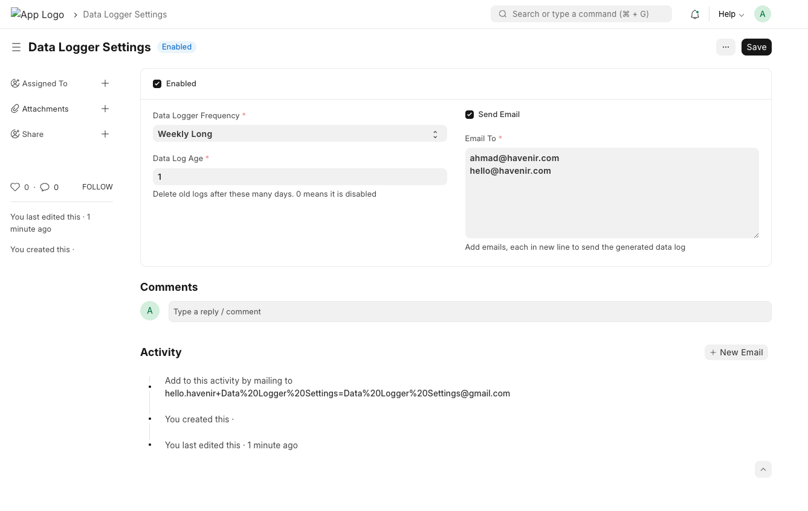
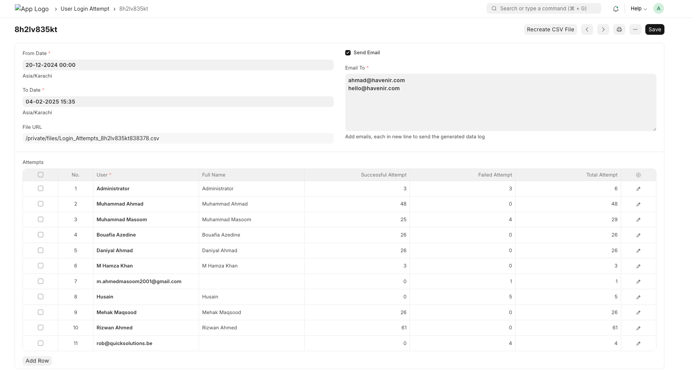
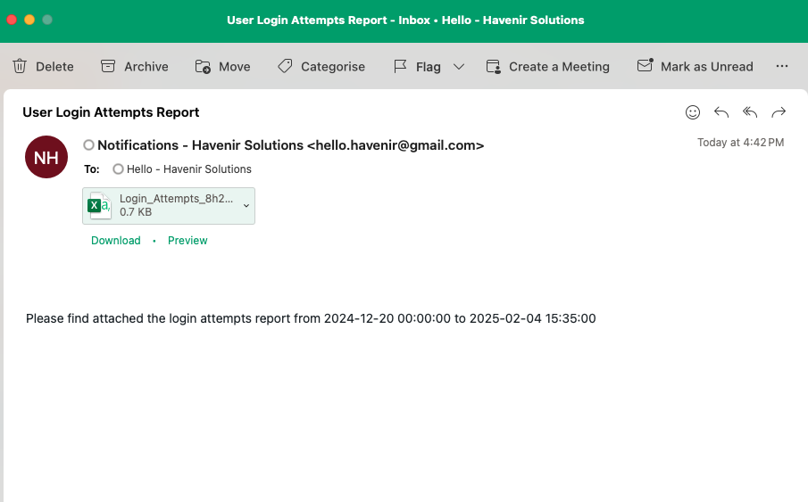

# Data Logger

## Overview
Data Logger is a Frappe-based application that logs site data for audit purposes. It allows tracking of login attempts through manual and scheduled logging.

## Features
- **Manual Logging**: Create login attempt logs on demand.
- **Enable Scheduled Logging**: Automatically log login attempts based on a configurable schedule:
  - Hourly
  - Daily
  - Weekly
  - Monthly
- Delete old logs

## Usage

### Settings Page
**Data Logger Settings**: Manage logging configurations.



### Form Layout
**User Form**: New form **User Login Attempt** added for logging user data.




## Email Output

The application supports email output for logged data.



## Installation
1. Install the app in your Frappe site:
   ```sh
   bench get-app https://github.com/ahmadpak/data_logger.git
   ```

   ```sh
   bench --site yoursite install-app data_logger
   ```

2. Set up the scheduler:

   ```sh
   bench --site yoursite enable-scheduler
   ```

3. Configure logging settings via the **Data Logger Settings** page in Frappe.


## License

This project is licensed under the **MIT License**.